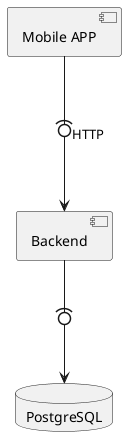

Para entender melhor o que é arquitetura de software, fiz um exercício de buscar definições nas redes sociais. Criei uma pesquisa e coletei respostas no Blue Sky, Mastodon e LinkedIn. Apesar de parecer amador, essa técnica é conhecida como "Teoria Embasada" (Grounded Theory), onde você coleta dados e a partir deles constrói uma teoria. Mas eu não quero fazer um artigo científico sobre como os desenvolvedores brasileiros entendem arquitetura de software, quero apenas entender o que eles pensam sobre o assunto.

Entre as respostas, encontrei definições interessantes, como:

1. "_É o planejamento e a organização em alto nível dos componentes de um sistema computacional, como estes componentes trocam informações entre si, como as informações são armazenadas e coletadas, quais os procedimentos de segurança envolvidos nestes processos, entre outros aspectos, utilizando boas  práticas e padrões de design._"
2. "_Penso como sendo o esqueleto de um sistema, a forma como os principais componentes são organizados e conectados para que funcionem de forma coerente. Vai além de diagramas, envolve decisões sobre tecnologias, padrões e compromissos para orientar o desenvolvimento e a evolução do sistema._"
3. "_Conhecimento da solução como um todo (integrar hardware, software de maneira eficiente)._"
4. "_Arquitetura é um olhar 'de longe' analisando como cada componente do sistema (ou sistemas) vai ser integrado, visando performance e facilidade de manutenção._"
5. "_Arte de planejar um software bem estruturado._"
6. "_Seria o 'design' de arquitetura que o projeto segue sendo MVC, DDD, TDD, BDD ou algo similar._"

Sendo sincero, essa pergunta não tem uma resposta correta, pois cada um vai entender arquitetura dentro do seu contexto e experiência. Mas, existem discussões que estão sendo realizadas há décadas e não podemos fugir delas. Len Bass, Paul Clements e Rick Kazman, autores do livro "Software Architecture in Practice", definem arquitetura de software como: "_A arquitetura de um sistema de software é um conjunto de estruturas necessárias para raciocinar sobre o sistema, que compreende elementos de software, relações entre eles e propriedades desses elementos e relações._"

É interessante notar que essa definição não foca no software em execução, mas na compreensão e no entendimento dos sistemas. Arquiteturas são feitas para pessoas e não para as máquinas. Mas para entender melhor essa definição, vamos discutir ponto a ponto delea.

## Arquitetura é um conjunto de Estruturas de Software

Um software não é apenas código. Existe racionalização dentro dele, existem decisões tomadas e através dessas decisões podemos compreender certas estruturas de software. Podemos começar falando e módulos, toda arquitetura possui intrisecamente o conceito de módulos.

### Módulos

Um módulo é uma porção de código que possuim uma ou mais responsabilidades. Em muitos casos essas responsabilidades podem não ser bem definidas, mas elas existem. Mas um módulo sempre possui uma separação lógica, e as vezes físicas, com os outros módulos.

Vamos pensar em um sistema que foi desenvolvido sem muito planejamento. Ele é apenas uma API HTTP, que se comunica com uma aplicação _mobile_ e usa um banco de dados. Apesar do sistema ser simples e não existir muito esforço para se definir a arquitetura, ele possui módulos bem definidos e que podem ser facilmente identificados: a API HTTP, a aplicação _mobile_ e o banco de dados. Pode parecer óbvio e é, ao se começar a racionalizar sobre a arquitetura, esse serão os primeiros módulos que serão identificados.

Mas essa não é a única forma de se identificar módulos. Podemos pegar uma lupa e analisar o código da API HTTP. Ao se identificar os endpoints, as classes, os pacotes e as bibliotecas, podemos identificar outros módulos. Cada módulo desse possui uma ou mais responsabilidades que trabalham em conjunto para compor a API HTTP. 

Aqui surge uma pergunta? Essa API HTTP pode evoluir? A resposta é sim. As estruturas de software são dinâmicas e em algum momento da história desse software, os desenvolvedores podem decidir decompor as responsabilidades desse módulo em outros módulos.

### Componentes e Conectores

Ao olhar para a arquitetura, vemos que os módulos interagem entre si. A aplicação _mobile_ envia requisições HTTP para a API, que por sua vez consulta o banco de dados. Podemos mapaer essa interações como componentes e conectores, que também são partes importantes de uma arquitetura de software. 

Roy Fielding na sua tese de doutorado que definiu o estilo arquitetural REST, define componentes como "_uma unidade abstrata de instruções de software e estado interno que fornece uma transformação de dados por meio de sua interface_". Essa definição pode ser complicada, e por isso eu redefiniria como "_uma unidade de software vista como um peça que pode interagir com outras peças através de uma interface. Ela recebe e envia dados transformando a informação".

Mas caso você não tenha reparado, há uma definição faltante. O que é uma interface e como se dá a comunicação entre os componentes? É aí que entram os conectores. Segundo Fielding, "_um conector é um mecanismo abstrato que medeia a comunicação, a coordenação ou a cooperação entre componentes_". Em outras palavras, um conector é a forma como definimos a comunicação entre os componentes. Ela não será uma porção de código, mas uma abstração. No nosso exemplo, o conector é a API HTTP. O componente não é a API HTTP, aliás, não seria nem correto chamarmos genericamente de API HTTP pois é muito importante dar nomes corretos aos componentes. Nesse caso podemos chamar o componente de "Backend", depois ao se identificar os submodulos, estes podem ser separados em serviços menores e chamados conforme a sua responsabilidade de domínio.

Essa arquitetura pode também ser descrita usando UML, conforme o código plantuml abaixo:

### Estruturas Organizacionais

A terceira forma de se compreender as estruturas de software é através das estruturas organizacionais da empresa. Software são feito por times de desenvolvimento e são mantidos por times de operaçoes. Esses times podem ser o mesmo, cabendo a uma só equipe desenvolver e cuidar da execução do software, ou podem ser times diferentes. 

Todo o processo de desenvolvimento, instalação, observação e manutenção do software são estruturas que podem ser detalhadas arquituralmente.

## Arquitetura é uma abstração

Podemos ver também a arquitetura como uma abstração. Toda arquitetura de software é uma representação de um sistema existente através de conceitos abstratos que servem para facilitar a compreensão do sistema e de suas interações. 

Vamos voltar ao sistema já discutido. Ao olharmos para o componente Backend, já o definimos como uma API HTTP. Isso pode ser compreendido que ele é um servidor que responde requisições HTTP. Através dessa definição, somos levados a pensar em um modelo de comunicação que é chamado cliente-servidor. Não existe um modelo concreto de cliente-servidor, mas isso é uma abstração que ajuda a descrever a forma como esse sistema se comunica com os seus clientes.

Ao usar de forma genérica o termo API HTTP, também podemos supor que este não pode ser classificado como uma API REST. O que nos leva a pergunta: "o que é uma API REST?". Tudo isso são abstrações, pois se pegarmos dois sistemas que são servidores RESTful, eles podem ser completamente diferentes entre si, mas podemos afirmar que ambos tem uma interface HTTP que segue complemetarmente o estilo arquitetural REST.

Dessa forma, podemos ver que a arquitetura de software é uma elaboração abstrata que nos ajuda a descrever sistema. Mas não podemos parar por aí. Uma arquitetura pode ser descrita de forma diferente a depender de para quem ela está sendo apresentada e de qual o nível de detalhe que se deseja apresentar.

## Todo software possui uma arquitetura

Outra implicação importante da definição de Arquitetura é que todo software possui uma arquitetura, seja ela bem definida ou não. Todo sistema possui módulos, componentes, conectores e estruturas organizacionais que os sustentam. Mesmo que ninguém nunca tenha parado para racionalizar sobre esses aspectos. 

Esses aspectos existem e podem ser identificados com clareza por arquitetos experientes. Se pegarmos um mesmo sistema e apresentarmos a dois arquitetos diferentes, é bem provável que ambos cheguem a conclusões parecidas sobre qual arquitetura o sistema possui. Eles podem discordar em pequenos detalhes, mas isso não seria um problema.

# Aviso

Esse post ainda não está finalizado. Ele foi publicado pois se trata do roteiro para o vídeo abaixo


